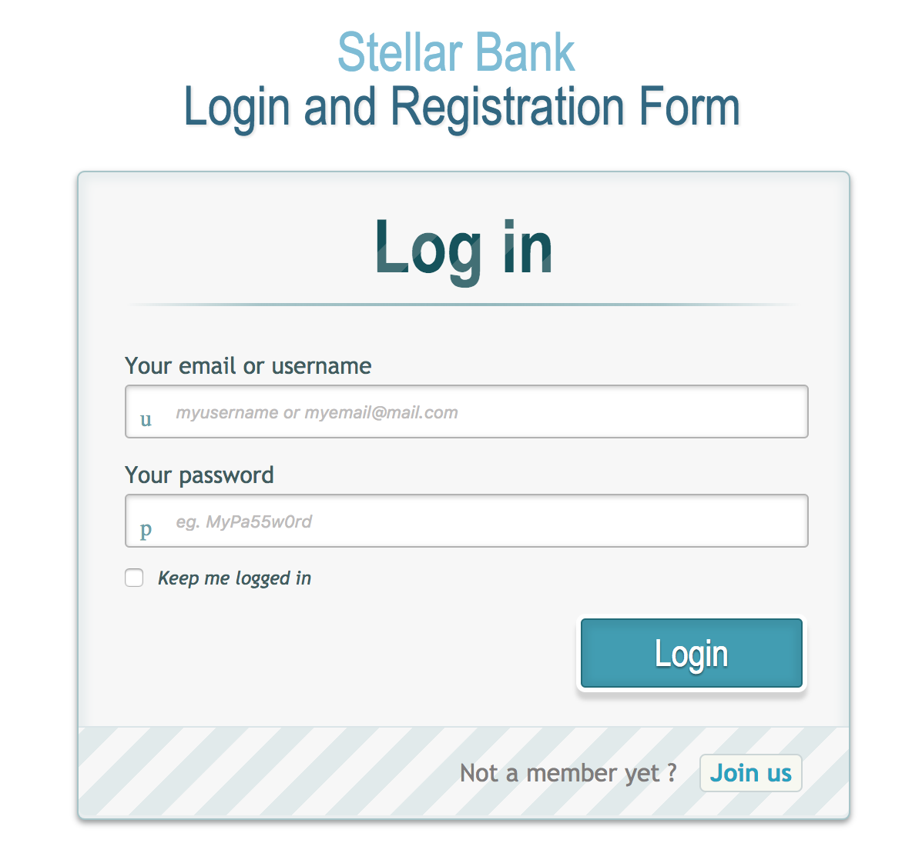

# Banking on Blockchain with Stellar - Tutorial

This is a tutorial for creating a simple banking application with [Stellar's](https://www.stellar.org/) hybrid blockchain and Lumen (XLM) as currency.
The following topics are covered in this tutorial:
1. Working with Stellar Java SDK
2. Creating a fully functional web application using Spring Boot, Spring Security and MySql
3. Open an Account and fund 10,000 XLM
4. Open another account and transfer 100 XLM from the first
5. View account details and blalances

## Getting Started

download the SDK from [Stellar.org](https://github.com/stellar/java-stellar-sdk) to your local file system

notice that this a jar file that needs to be imported into your local Maven repo.

### Import the jar into Maven repo

Use the following command to import the SDK jar file into your Maven repo:

```
mvn install:install-file -Dfile=/<path to the sdk jar> -DgroupId=<package name> -DartifactId=<packageId> -Dversion=<version> -Dpackaging=jar

```

For example :

```
mvn install:install-file -Dfile=/Users/sunil_vishnubhotla/Downloads/stellar-sdk.jar -DgroupId=com.stellar.code -DartifactId=stellar -Dversion=0.1.14 -Dpackaging=jar

```


Then add the dependancy in your pom.xml file like so :

```
<dependency>
     <groupId>com.stellar.code</groupId>
     <artifactId>stellar</artifactId>
     <version>0.1.14</version>
</dependency>

```

Note: this dependancy is already added in the source.

### Installing

To run the sample, install Maven, Java 1.8+, MySql and download the code. 
Edit the application.properties file to setup your DB connection.

And simply run this command in the source root


```
mvn springboot:run
```

And point your browser to 

```
http://localhost:8080
```

login screen :



End with an example of getting some data out of the system or using it for a little demo

## Running the tests

Explain how to run the automated tests for this system

### Break down into end to end tests

Explain what these tests test and why

```
Give an example
```

### And coding style tests

Explain what these tests test and why

```
Give an example
```

## Deployment

Add additional notes about how to deploy this on a live system

## Built With

* [Spring Boot](https://projects.spring.io/spring-boot/) - The web framework used
* [Spring Security](https://projects.spring.io/spring-security/) - User authentication
* [Spring Data JPA](https://projects.spring.io/spring-data-jpa//) - Data access layer
* [Maven](https://maven.apache.org/) - Dependency Management
* [MySql](https://rometools.github.io/rome/) - RDBMS

## Contributing

Please read [CONTRIBUTING.md](CONTRIBUTING.md) for details on our code of conduct, and the process for submitting pull requests to us.

## Versioning

We use [TBD](http://tbd.org/) for versioning. For the versions available, see the [tags on this repository](https://github.com/your/project/tags). 

## Authors

* **Sunil Vishnubhotla** - *Initial work* - [sunilvb](https://github.com/sunilvb)

See also the list of [contributors](https://github.com/your/project/contributors) who participated in this project.

## License

This project is licensed under the MIT License - see the [LICENSE.md](LICENSE.md) file for details

## Acknowledgments

* Hat tip to anyone who's code was used
* Inspiration
* etc

## Donations :
XLM = > GCFV72GPGTP7QY5HZUE5YGFO5LZ3PXO6Q7OGT6VKZZFBQ2AO62THYJA5
